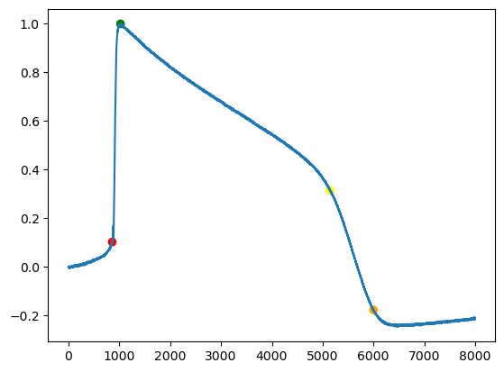

# Feature-Functions

Function ChangePoints returns 4 points (timestep locations) for every intra-cellular recording. These 4 points roughly divide the intra-cellular signal into regions that are approximately linear. This is illustrated by the figure below.

